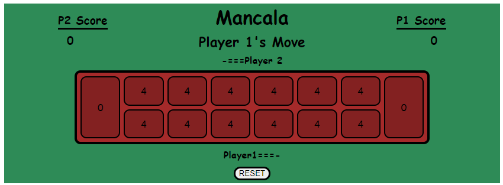
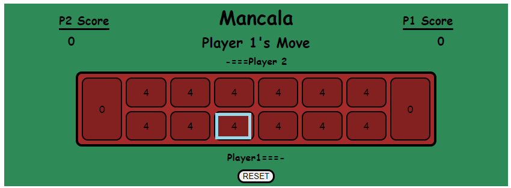
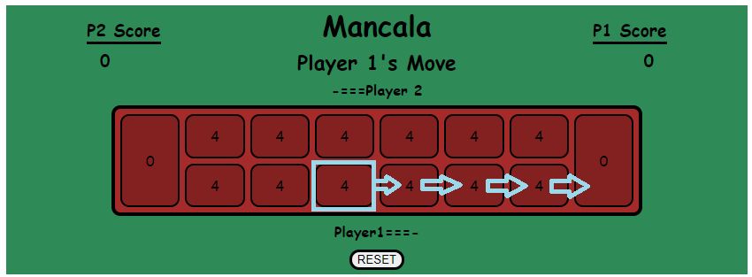
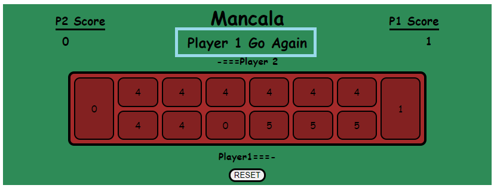
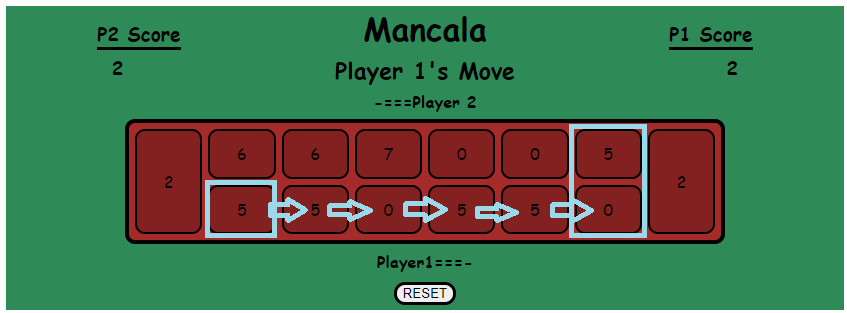
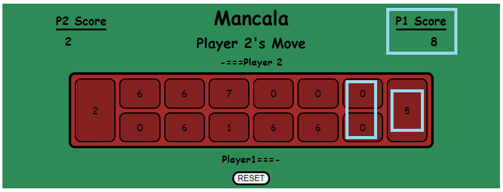
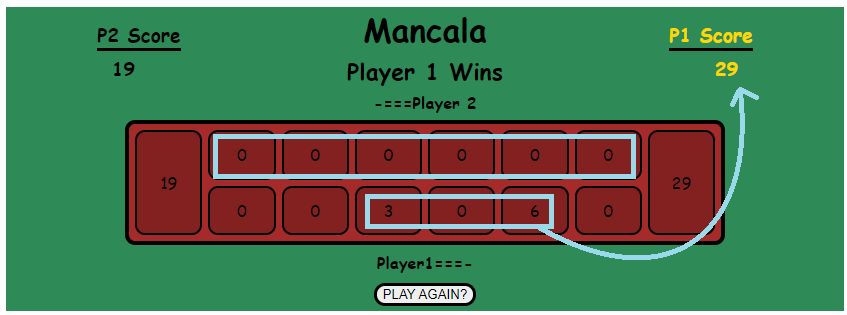
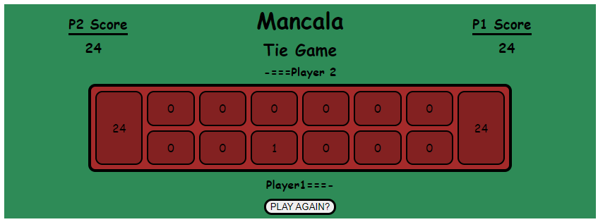

# Mancala

## Background

Mancala is a family of two-player strategy games, with regional variants spanning the globe. Some versions can be traced back to the 7th Century. There is even evidence of it existing in ancient Egypt, making it one of the oldest games still being played in the world today.

---

## Description

### Game Board

- The game board is set up with two rows of six small holes, called _houses_ and two larger holes on the ends called _banks_. Each house is filled with 4 _stones_ and the banks are left empty.

- Each player controls the houses on their side of the board, and the bank on their right. The goal is to have the most stones in your bank at the end of the game.
  

### Player Turn

- At the start of each player's turn, they pick a house on their side and take all of the stones from that house into their hand.
  

- Moving counter-clockwise around the board they place one stone in each house, including their bank but not their opponent's bank, until there are no more stones in their hand.

- If the last stone placed lands in that player's bank, that player gets another turn.
  
  

- If the last stone lands in an empty house on their side, and the opposite house on their opponent's side contains stones, then the last stone placed by the player and all of the stones from the opposite house are moved into the player's bank.
  
  

### End Game

- The game ends when all of one player's houses are empty.

- At which point all remaining stones in the opponent's houses are added to the opponent's total score.

- Total scores are then compared to determine the winner.
  

- Due to the even number of stones, tie games are possible.
  

---

## Technologies Used

To create this game I used HTML, CSS and JavaScript

---

## Play Here

[Click Here to Play Now](https://kevindecker64.github.io/Mancala/)

Once inside, all you need to do is click the house you want to activate on your turn and let JavaScript do the rest.

---

## Icebox Items

Further advancements I would plan on making include:

1. Responsiveness to devices
2. Set an interval between the placement of each stone on a Player's turn
3. Adding a button to open an rules window
4. Use icons of stones instead of number values
